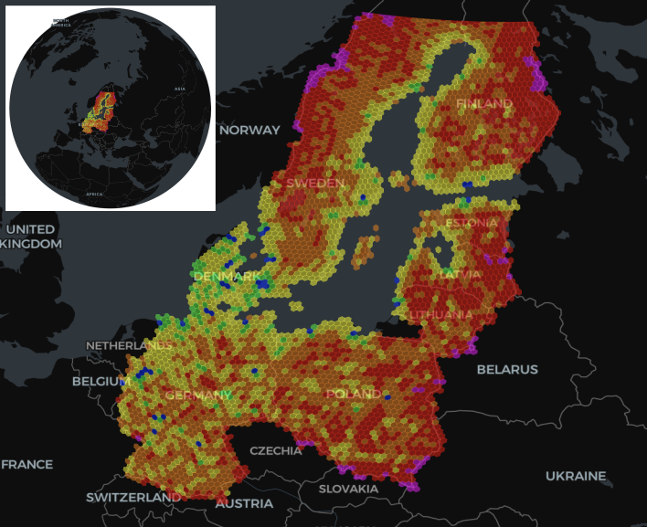

.. pydggsapi documentation master file, created by
   sphinx-quickstart on Fri Jun 27 14:40:29 2025.
   You can adapt this file completely to your liking, but it should at least
   contain the root `toctree` directive.

pydggsapi documentation
=======================

A python FastAPI OGC DGGS API implementation. 

OGC API - Discrete Global Grid Systems
--------------------------------------

https://ogcapi.ogc.org/dggs/

OGC API - DGGS specifies an API for accessing data organised according to a Discrete Global Grid Reference System (DGGRS). A DGGRS is a spatial reference system combining a discrete global grid hierarchy (DGGH, a hierarchical tessellation of zones to partition) with a zone indexing reference system (ZIRS) to address the globe. Aditionally, to enable DGGS-optimized data encodings, a DGGRS defines a deterministic for sub-zones whose geometry is at least partially contained within a parent zone of a lower refinement level. A Discrete Global Grid System (DGGS) is an integrated system implementing one or more DGGRS together with functionality for quantization, zonal query, and interoperability. DGGS are characterized by the properties of the zone structure of their DGGHs, geo-encoding, quantization strategy and associated mathematical functions.

|bids25_fig1|

.. toctree::
   :glob:
   :hidden:
   

   introduction
   Configuration <tinydb_configuration/index>
   providers/index
   API endpoints examples <example_notebook/Endpoints_Examples.ipynb>
