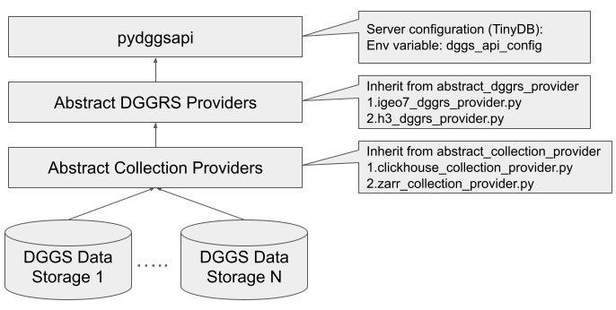

Introduction
=======================

pydggsapi runs on python3. It provides an easy setup for users to publish DGGS-enabled data sources. It uses FastAPI as the core component to implement the OGC DGGS API standard. pydggsapi also aims to provide a flexible structure that can easily extend to support different DGGRS and data storage. The following diagram shows the overall structure of pydggsapi:

|overall_structure|

pydggsapi uses TinyDB to store the definitions of collections, DGGRS providers and collection providers. You can specify the path of the DB in the environment variable ``dggs_api_config``.

This structure provides two abstract class definitions that allow developers to quickly implement new DGGRS and Collection providers to work with pydggsapi. The DGGRS and collections providers serve as accessors to collections. Currently, it supports: 

* DGGRS: `IGEO7 <https://agile-giss.copernicus.org/articles/6/32/2025/>`_ ,  `H3 <https://h3geo.org/>`_

* Collection provider: Clickhouse, Zarr

Quick setup 
---------------------------

* In order to work with IGEO7 (using `DGGRID <https://github.com/sahrk/DGGRID>`_), the dggrid executable needs to be available. You can compile it yourself, or install into the conda/micromamba environment from conda-forge:

.. code-block:: bash

    micromamba install -c conda-forge dggrid
    export DGGRID_PATH = <path to dggrid executable>

1. Install pydggsapi using pypi (under the same virtual environment of ``dggrid``):

.. code-block:: bash

    pip install pydggsapi

or install the latest updates from GitHub (under the same virtual environment of ``dggrid``):

.. code-block:: bash

    pip install git+https://github.com/LandscapeGeoinformatics/pydggsapi.git

2. create a local ``.env`` file from the ``env.sample``. Change the environment variables according to your local environment setup. Please refer to the :doc:`configuration </tinydb_configuration/index>` for more details.

.. code-block:: bash
    
    dggs_api_config=<Path to TinyDB>
    DGGRID_PATH=<Path to dggrid executable>

3. Start the server:
   
.. code-block:: bash

   pydggsapi

Docker build
------------

We have now a Dockerfile (thanks to CRIM/https://github.com/fmigneault) that allows you to easily build and run pydggsapi in a containerized environment.

You can build the docker image using the following command:

.. code-block:: bash

   docker build -t pydggsapi:tag -f docker/Dockerfile .
   

Quick setup for development
---------------------------
1. setup virtual environment with micromamba file and active it. 

.. code-block:: bash

    git clone https://github.com/LandscapeGeoinformatics/pydggsapi.git
    cd pydggsapi
    micromamba create -n <name>  -f micromamba_env.yaml
    mircomamba activate <name>

In order to work with IGEO7 (using `DGGRID <https://github.com/sahrk/DGGRID>`_), the dggrid executable needs to be available. You can compile it yourself, or install into the conda/micromamba environment from conda-forge:

.. code-block:: bash

    micromamba install -c conda-forge dggrid

2. run poetry to install dependencies
   
.. code-block:: bash

   poetry install

3. create a local ``.env`` file from the ``env.sample``. Change the environment variables according to your local environment setup. 

.. code-block:: bash
    
    dggs_api_config=<Path to TinyDB>
    DGGRID_PATH=<Path to dggrid executable>

4. Start the server: 
   
.. code-block:: bash

   pydggsapi

