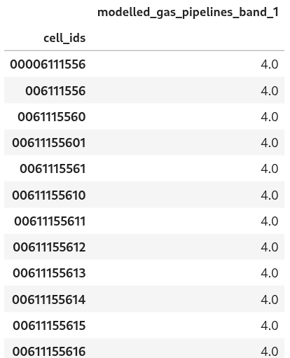

Parquet Collection Provider
==============================

The implementation uses `duckdb <https://duckdb.org/>`_ as the driver to access the data in parquet format. The duckdb starts in `in-memory` mode and uses the extension ``httpfs`` for cloud storage access. Each data source has its own ``duckdb.DuckDBPyConnection`` object from the ``duckdb.connect()`` function, and sets up the secret if needed for the connection. 
Therefore, multiple cloud providers can be supported by the same parquet providers and different bucket credentials. All data source info are stored as a dictionary in ``self.datasources`` for retrieval. The key of the dictionary represents the ID of the data source. 

Organisation of the dataset with multiple refinement levels
-----------------------------------------------------------
The user must arrange all zone IDs at different refinement levels into a single column (e.g. `cell_id`), and ensure that the data at coarser refinement levels is aggregated; the provider doesn't perform any aggregation on the fly. An example screenshot of a parquet dataset with multiple refinement levels is shown below.

|parquet_data_example|

Constructor parameters
----------------------
For ``initial_params`` uses in :ref:`collection_providers <collection_providers>`

It is a nested dictionary. At the root level, the dictionary ``datasources`` contains information about the parquet data sources. User defines the parquet data sources as child dictionaries under ``datasources``. The key of the child dictionary represents the unique ID for the parquet data. 

An example to define a Parquet collection provider:

.. code-block:: json

    "collection_providers": {"1": 
    {
      "parquet": {
        "classname": "parquet_collection_provider.ParquetCollectionProvider",
        "initial_params": {
          "datasources": {
            "hytruck": {
              "filepath": "gcs://<path to parquet file>",
			  "id_col": "cell_ids",
			  "data_cols": ["*"], 
              "credential" "TYPE gcs, KEY_ID 'myKEY', SECRET 'secretKEY'" 
            }
          }
        }
      }
    }
    

To define a parquet data source, two mandatory parameters are required: 

* ``filepath``: the file path of the parquet file.
* ``id_col``: a string to indicate the column name of zone ID.

Optional parameters:

* ``data_cols``: A list of strings specifying a set of data column names used to serve queries. In the case of all columns, the user can use the short form:  ``["*"]``. Default to ``["*"]``
* ``credential``: a string that is in the form of `temporary secrets from duckdb <https://duckdb.org/docs/stable/configuration/secrets_manager.html>`_. To specify a custom s3 endpoint, please refer `here <https://duckdb.org/docs/stable/core_extensions/httpfs/s3api.html>`_.

get_data parameters
----------------------

For ``getdata_params`` uses in :ref:`collections <collections>`

* ``datasource_id`` : the unique ID defines for a parquet data source under ``initial_params``

A collection example of using parquet collection provider :

.. code-block:: json 

    "collections": {"1": 
                    {"suitability_hytruck_parquet": 
                        {
                         "title": "Suitability Modelling for Hytruck in parquet data format",
                         "description": "Desc", 
                         "collection_provider": {
                                  "providerId": "parquet", 
                                  "dggrsId": "igeo7",
                                   "maxzonelevel": 9,
                                   "getdata_params": { 
                                           "datasource_id" : "hytruck"
                                    } 
                            }
                        }
                    }
                } 

