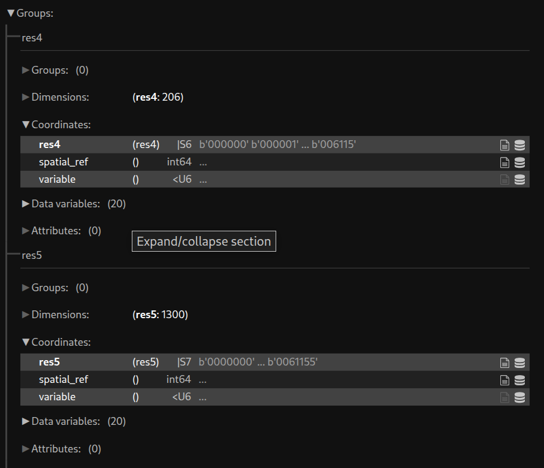

Zarr Collection Provider
==============================

The implementation uses `xarray.Datatree <https://docs.xarray.dev/en/latest/generated/xarray.DataTree.html>`_ as the driver to access Zarr data. The provider serves multiple Zarr data sources. At the initialisation stage, it loads the ``datasources`` setting from the ``initial_params`` to get each Zarr data configuration, then it creates an xarray datatree handler for each of them and stores it under ``self.datasources`` with the id as the key.

Each group of the Zarr data source represents data from the same refinement level, with zone IDs as the index. Here is an example of how Zarr data is organised. 

|zarr_data_example|

Constructor parameters
----------------------

For ``initial_params`` uses in :ref:`collection_providers <collection_providers>`

It is a nested dictionary. At the root level, the dictionary ``datasources`` contains information about one or more Zarr data sources in the form of a child dictionary. The key of the child dictionary represents the unique ID for the Zarr data. Currently, only local storage is supported.

An example to define a Zarr collection provider:

.. code-block:: json

    "collection_providers": {"1": 
            {"zarr": 
                {"classname": "zarr_collection_provider.ZarrCollectionProvider", 
                  "initial_params": 
                          { "datasources": {
                                    "my_zarr_data": {
                                        "filepath": "<path to zarr folder>",
                                        "id_col": "zoneId",
                                        "zones_grps" : { "4": "res4", "5": "res5"}
                                    } 
                            } 
                        }
                }
            }
    }

   

For each Zarr data, two parameters are required: 

* ``filepath``   : the local directory path of the data.
* ``zones_grps`` : a dictionary that maps refinement level to group name of the data.
* ``id_col``     : the coordinate name of the zone IDs, assume that all groups share the same coordinate name. If not supplied, the ``zones_grps`` value is used.

get_data parameters
----------------------

For ``getdata_params`` uses in :ref:`collections <collections>`

* ``datasource_id`` : the unique ID defines for a Zarr data under ``initial_params``

A collection example of using Zarr collection provider :

.. code-block:: json 

    "collections": {"1": 
                    {"suitability_hytruck_zarr": 
                        {
                         "title": "Suitability Modelling for Hytruck in Zarr Data format",
                         "description": "Desc", 
                         "collection_provider": {
                                  "providerId": "zarr", 
                                  "dggrsId": "igeo7",
                                   "maxzonelevel": 5,
                                   "getdata_params": { 
                                           "datasource_id" : "my_zarr_data"
                                    } 
                            }
                        }
                    }
                } 

